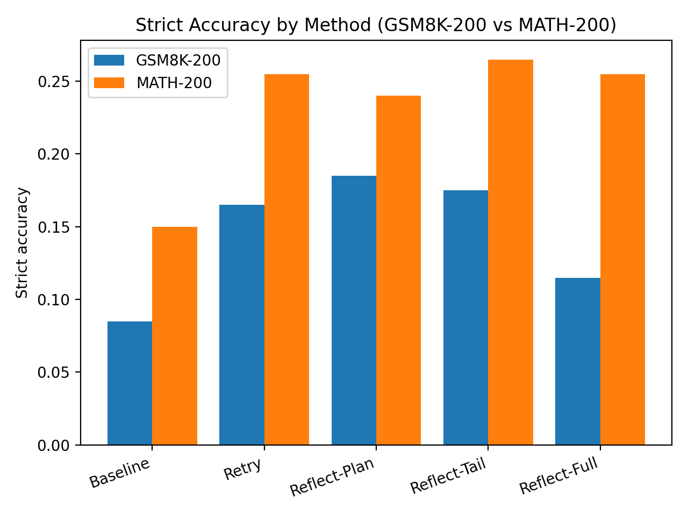
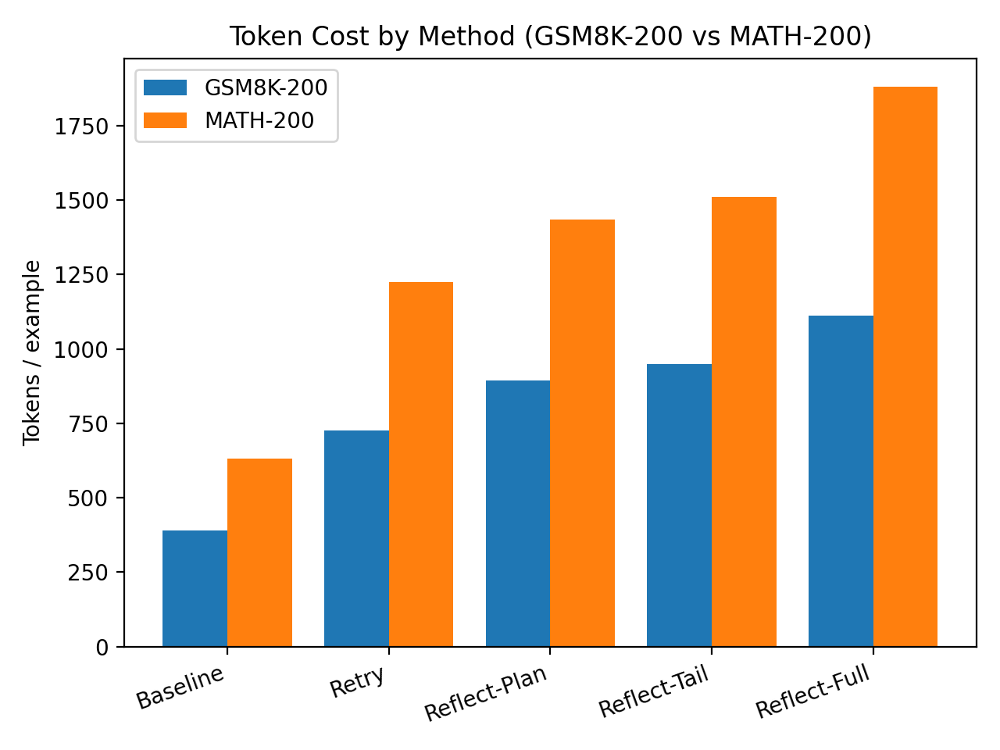
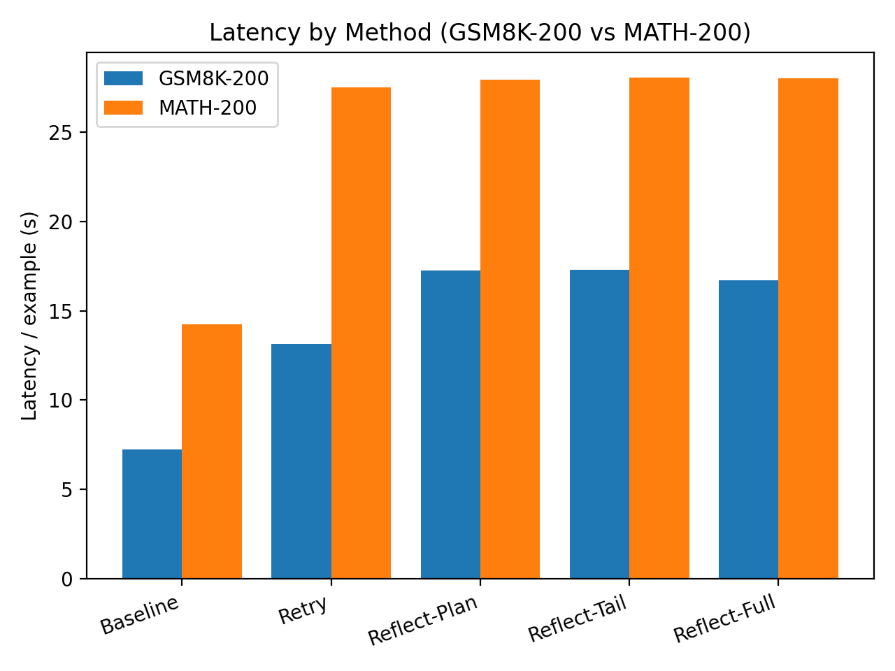
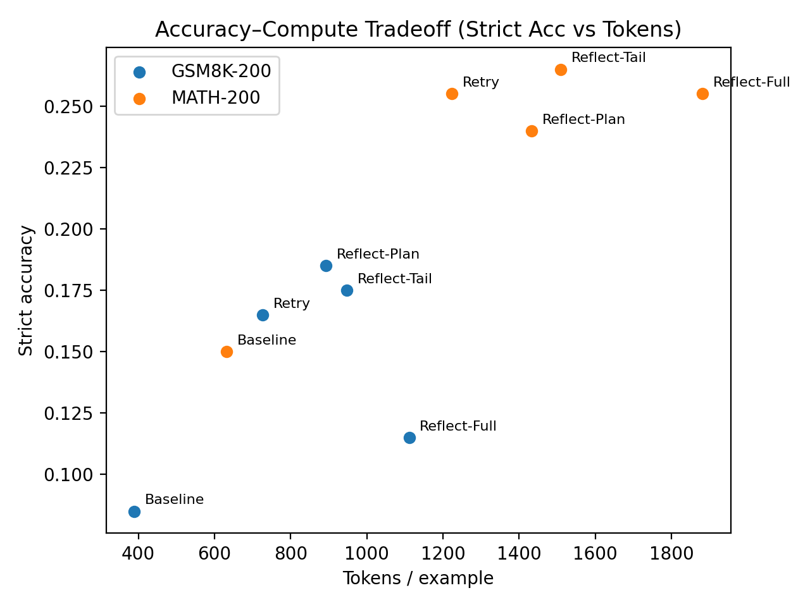

# LM Reflection + Step-Local Credit Assignment

This repo investigates whether **step-local credit assignment** (predicting where reasoning fails) can outperform **outcome-gated reflection** (RRR-style) on math reasoning with curriculum learning.

## Methods
- **Baseline RLVR-CoT**: outcome reward on final answer
- **RRR (Outcome-gated reflection + retry)**: reward reflection tokens only when retry succeeds
- **Step-local credit assignment**: learn/predict mistake step index and weight policy gradients by step region

## Repo layout
- `src/rrr/` — reflection + retry training and prompting
- `src/step_credit/` — mistake-step labeler + locator + weighted RL
- `src/eval/` — first-try and retry evaluation
- `configs/` — experiment configs
- `scripts/` — entrypoints for training/eval
- `notebooks/` — plotting and analysis

## Quickstart
1. Create venv and install deps
2. Prepare data
3. Run baseline, RRR, and step-credit experiments
4. Generate plots

## Step 1: Pretraining Inference Results
All runs logged to `results/` (ignored by git). Use `notebooks/` to plot.

## Pretrain Inference Results (Qwen/Qwen2.5-0.5B-Instruct)

We evaluate four inference strategies — **baseline**, **retry-only**, **reflection-full**, **reflection-plan**, and **reflection-tail** — on two reasoning benchmarks:

- GSM8K-200 (grade-school arithmetic)
- MATH-200 (competition math)

All experiments use identical prompts, decoding limits, and model weights. Differences arise only from inference strategy.

---

### GSM8K-200

| Method | Strict Accuracy | Δ vs Baseline | Tokens / Example | Latency / Example |
|--------|-----------------|---------------|-------------------|-------------------|
| Baseline | 0.085 | — | **390** | **7.23 s** |
| Retry | 0.165 | +0.080 | 727 | 13.14 s |
| Reflect-Full | 0.115 | +0.030 | 1111 | 16.72 s |
| Reflect-Plan | **0.185** | **+0.100** | 893 | 17.27 s |
| Reflect-Tail | 0.175 | +0.090 | 948 | 17.30 s |

**Takeaways**

- Structured reflection improves reasoning.
- Planning-style reflection works best.
- Long reflection hurts efficiency.
- Retry alone already gives large gains.

---

### MATH-200

| Method | Strict Accuracy | Δ vs Baseline | Tokens / Example | Latency / Example |
|--------|-----------------|---------------|-------------------|-------------------|
| Baseline | 0.150 | — | **632** | **14.24 s** |
| Retry | 0.255 | +0.105 | 1223 | 27.51 s |
| Reflect-Full | 0.255 | +0.105 | 1881 | 28.02 s |
| Reflect-Tail | **0.265** | **+0.115** | 1509 | 28.08 s |
| Reflect-Plan | 0.240 | +0.090 | 1433 | 27.95 s |

**Takeaways**

- Hard math benefits more from search than reflection.
- Tail reflection is best for difficult reasoning.
- Full reflection adds cost but little gain.

---

### Plots

  
  

  
  

---

### Cross-Dataset Insights

- Retry is a strong baseline.
- Reflection must be constrained to help.
- Short reflections outperform long ones.
- Best method depends on task difficulty.

| Dataset | Best Method |
|--------|-------------|
| GSM8K | Reflect-Plan |
| MATH | Reflect-Tail |

---

### Key Finding

> LLM reasoning performance appears largely search-limited rather than capability-limited.

Reflection mainly helps by guiding search rather than generating new reasoning ability.

---

## Phase 2: SFT + RLVR Fine-tuning (Qwen3-4B-Instruct)

We train a LoRA adapter on top of `Qwen/Qwen3-4B-Instruct-2507` using supervised fine-tuning (SFT) followed by reinforcement learning with verifiable rewards (RLVR). RLVR uses rejection-sampling fine-tuning (RFT): at each step, the model samples outputs and trains only on correct ones with a binary reward signal from a math verifier.

Each training run is 200 steps on a mixed GSM8K + MATH training set. Evaluation uses 200 held-out examples per dataset.

All conditions are evaluated with a **single forward pass** (no retry at inference), so token costs are identical across conditions and accuracy differences reflect purely what each training method taught the model.

### GSM8K-200 (single-pass eval)

| Condition | SFT | RLVR | Δ (RLVR) |
|---|---|---|---|
| Baseline CoT | 34.5% | 32.0% | -2.5% |
| Retry Only | 32.0% | **35.0%** | **+3.0%** |
| Reflect-Full | 28.5% | 31.0% | +2.5% |
| Reflect-Plan | 27.0% | 28.0% | +1.0% |
| Step Credit | — | **32.5%** | — |

### MATH-200 (single-pass eval)

| Condition | SFT | RLVR | Δ (RLVR) |
|---|---|---|---|
| Baseline CoT | 15.5% | 15.0% | -0.5% |
| Retry Only | **20.5%** | 20.0% | -0.5% |
| Reflect-Full | 16.5% | **17.0%** | **+0.5%** |
| Reflect-Plan | 16.5% | 15.5% | -1.0% |
| Step Credit | — | 16.0% | — |

### MATH-200 by Difficulty Level (RLVR, single-pass)

| Condition | L1 | L2 | L3 | L4 | L5 |
|---|---|---|---|---|---|
| Baseline CoT | 38.1% | 30.0% | 17.3% | 7.3% | 1.8% |
| Retry Only | **47.6%** | 33.3% | 23.1% | 4.9% | **10.7%** |
| Reflect-Full | **47.6%** | 23.3% | 23.1% | 7.3% | 3.6% |
| Reflect-Plan | 42.9% | 30.0% | 19.2% | 4.9% | 1.8% |
| Step Credit | 38.1% | 33.3% | 17.3% | **9.8%** | 1.8% |

### Takeaways

- **Retry Only SFT does not improve single-pass reasoning** (32.0% GSM8K, same as Baseline CoT SFT at 34.5% when retry removed): training on retry trajectories via SFT teaches the model *how to retry*, but the benefit only appears after the RLVR stage — suggesting SFT alone does not internalize better first-pass reasoning from retry supervision.
- **Retry Only RLVR produces the largest lift on GSM8K** (+3.0%): once RLVR is applied, retry-trained models significantly improve single-pass accuracy, indicating that RL on retry signals does teach better reasoning when the reward signal is tight enough.
- **Reflect-Full RLVR is second** (+2.5% GSM8K, +0.5% MATH): reflection training generalizes well to single-pass reasoning, suggesting the model learns to think more carefully in general, not just when given a second chance.
- **RLVR hurts solve-only and plan-style conditions**: Baseline CoT (−2.5% GSM8K), Reflect-Plan (−1.0% MATH) both regress, suggesting RFT without structured output supervision causes drift on harder problems.
- **Step Credit (32.5% GSM8K) outperforms Retry Only SFT (32.0%) and Reflect-Full RLVR (31.0%) on GSM8K** at identical single-pass inference cost, supporting the hypothesis that step-local credit assignment produces more targeted gradient updates than either retry supervision or outcome-gated reflection alone.
- **MATH is more resistant**: only Reflect-Full RLVR improves on MATH (+0.5%), all other conditions are flat or regress, suggesting 200 training steps is insufficient to move harder competition math regardless of training strategy.
