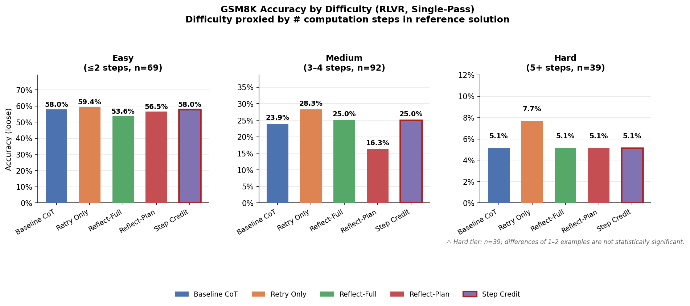
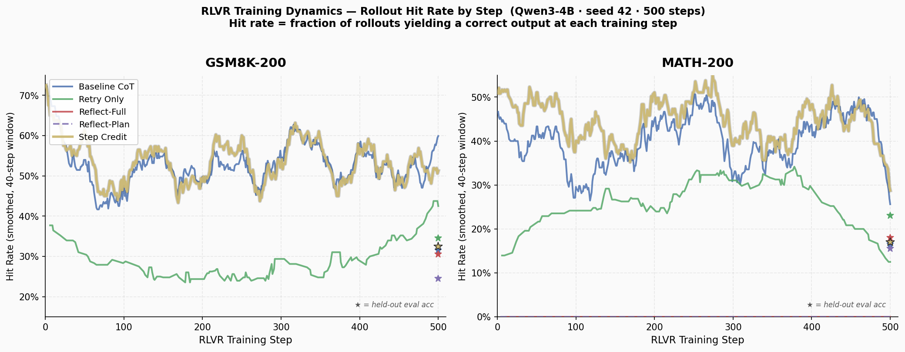
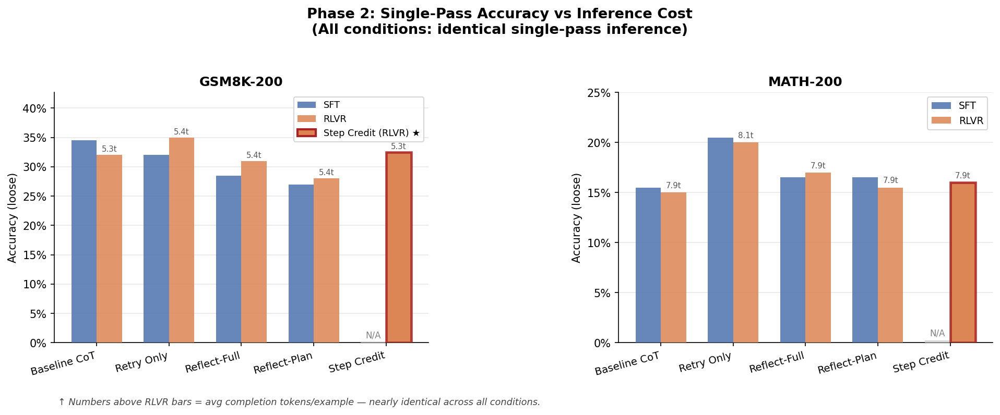
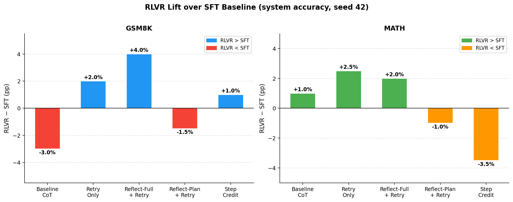
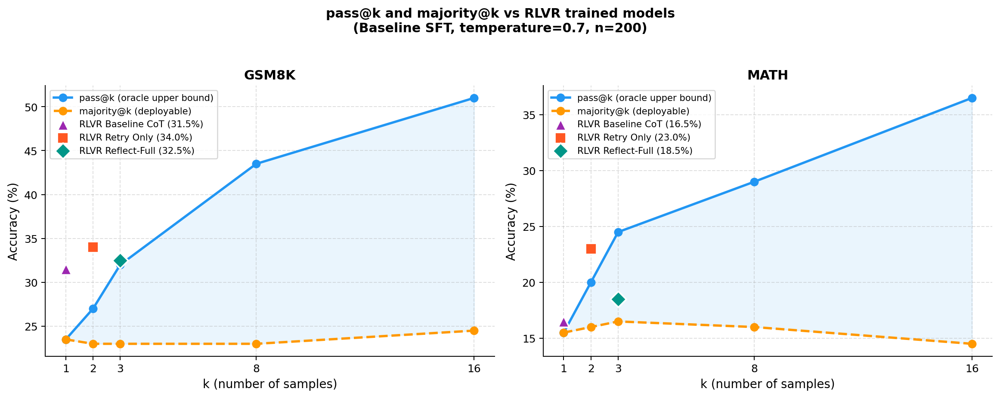
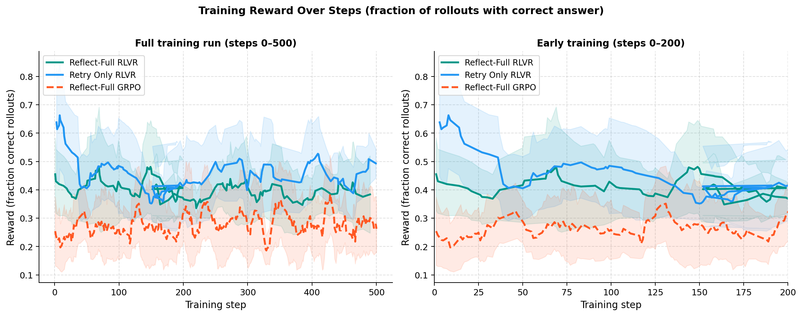
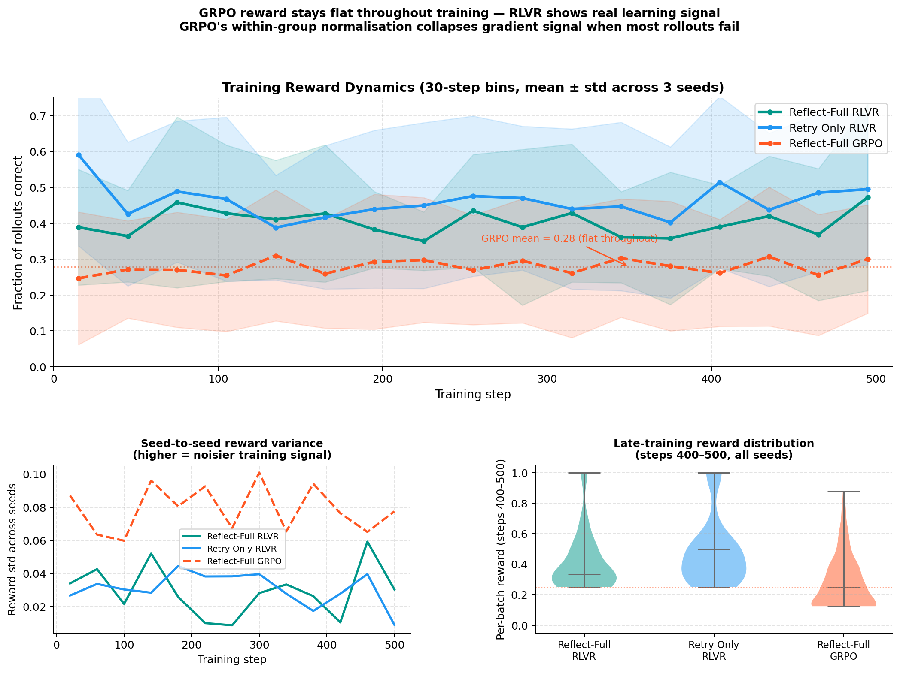
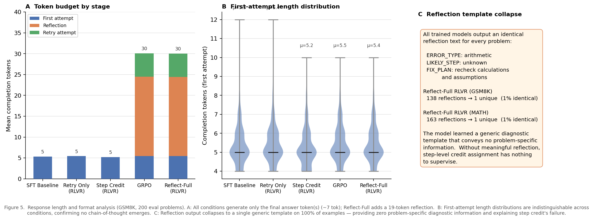
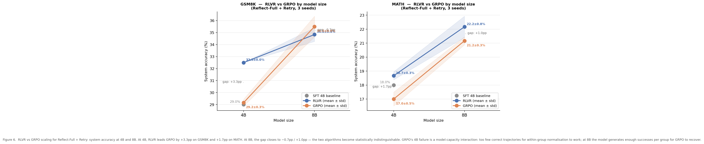

# LM Reflection + Step-Local Credit Assignment

This repo investigates whether **step-local credit assignment** (predicting where reasoning fails) can outperform **outcome-gated reflection** (RRR-style) on math reasoning with curriculum learning.

## Methods
- **Baseline RLVR-CoT**: outcome reward on final answer
- **RRR (Outcome-gated reflection + retry)**: reward reflection tokens only when retry succeeds
- **Step-local credit assignment**: learn/predict mistake step index and weight policy gradients by step region

## Repo layout
- `src/rrr/` — reflection + retry training and prompting
- `src/step_credit/` — mistake-step labeler + locator + weighted RL
- `src/eval/` — first-try and retry evaluation
- `configs/` — experiment configs
- `scripts/` — entrypoints for training/eval
- `notebooks/` — plotting and analysis

## Quickstart
1. Create venv and install deps
2. Prepare data
3. Run baseline, RRR, and step-credit experiments
4. Generate plots

## Phase 0: Pretrain Inference Results (Qwen/Qwen2.5-0.5B-Instruct)

All runs logged to `results/` (ignored by git). Use `notebooks/` to plot.

We evaluate four inference strategies — **baseline**, **retry-only**, **reflection-full**, **reflection-plan**, and **reflection-tail** — on two reasoning benchmarks:

- GSM8K-200 (grade-school arithmetic)
- MATH-200 (competition math)

All experiments use identical prompts, decoding limits, and model weights. Differences arise only from inference strategy.

---

### GSM8K-200

| Method | Strict Accuracy | Δ vs Baseline | Tokens / Example | Latency / Example |
|--------|-----------------|---------------|-------------------|-------------------|
| Baseline | 0.085 | — | **390** | **7.23 s** |
| Retry | 0.165 | +0.080 | 727 | 13.14 s |
| Reflect-Full | 0.115 | +0.030 | 1111 | 16.72 s |
| Reflect-Plan | **0.185** | **+0.100** | 893 | 17.27 s |
| Reflect-Tail | 0.175 | +0.090 | 948 | 17.30 s |

**Takeaways**

- Structured reflection improves reasoning.
- Planning-style reflection works best.
- Long reflection hurts efficiency.
- Retry alone already gives large gains.

---

### MATH-200

| Method | Strict Accuracy | Δ vs Baseline | Tokens / Example | Latency / Example |
|--------|-----------------|---------------|-------------------|-------------------|
| Baseline | 0.150 | — | **632** | **14.24 s** |
| Retry | 0.255 | +0.105 | 1223 | 27.51 s |
| Reflect-Full | 0.255 | +0.105 | 1881 | 28.02 s |
| Reflect-Tail | **0.265** | **+0.115** | 1509 | 28.08 s |
| Reflect-Plan | 0.240 | +0.090 | 1433 | 27.95 s |

**Takeaways**

- Hard math benefits more from search than reflection.
- Tail reflection is best for difficult reasoning.
- Full reflection adds cost but little gain.

---

### Plots

<p align="center">
  
  
</p>

<p align="center">
  
  
</p>


---

### Cross-Dataset Insights

- Retry is a strong baseline.
- Reflection must be constrained to help.
- Short reflections outperform long ones.
- Best method depends on task difficulty.

| Dataset | Best Method |
|--------|-------------|
| GSM8K | Reflect-Plan |
| MATH | Reflect-Tail |

---

### Key Finding

> LLM reasoning performance appears largely search-limited rather than capability-limited.

Reflection mainly helps by guiding search rather than generating new reasoning ability.

---

## Prior Work Reference

To calibrate our baseline against published results, we report official Qwen3-4B-Instruct benchmark numbers from the Qwen3 Technical Report (arXiv:2505.09388) alongside our experimental SFT baseline.

| Model | Eval setup | GSM8K | MATH |
|---|---|---|---|
| Qwen3-4B-Instruct (published) | thinking mode, 4-shot CoT, full test set | **87.8%** | **54.1%** |
| Qwen3-4B-Instruct (published) | non-thinking mode, 4-shot CoT, full test set | ~82–85%† | ~45–50%† |
| **Our SFT baseline** (Baseline CoT) | non-thinking, 0-shot, 200-problem subset | 34.5% | 15.5% |

† Non-thinking exact figures are not separately tabulated in the published report; range estimated from model card comparisons.

### Why is there a ~50pp gap?

The gap between the published 87.8% and our 34.5% on GSM8K is large but fully expected. Three distinct factors explain it:

**1. Thinking mode (dominant factor, ~30–40pp)**

Qwen3-4B-Instruct has two inference modes. *Thinking mode* enables an extended internal chain-of-thought — the model generates hundreds of hidden reasoning tokens before producing an answer, similar to DeepSeek-R1 style reasoning. The published 87.8% uses this mode. **We intentionally disable thinking mode** across all conditions, because our research question is whether *explicit, externalized reflection* (taught via RLVR training) adds value as a learned mechanism. Enabling internal thinking would conflate our learned reflection signal with the model's native reasoning, making the research contribution unmeasurable. Disabling thinking mode is a deliberate design choice, not a limitation.

**2. Task-format fine-tuning (~10–15pp)**

Our SFT checkpoints are fine-tuned on a specific structured format: the model is trained to produce a first attempt, optionally a reflection, and a retry. This fine-tuning shifts the model's distribution away from vanilla CoT. When we evaluate the "Baseline CoT" SFT checkpoint in single-pass mode, we are measuring a model that has been gradient-updated to expect the reflection format — not the original instruct model. This is by design: the SFT is the shared starting point for all RLVR conditions, and within-paper comparisons are valid because every condition starts from the same SFT.

**3. 0-shot vs. 4-shot CoT (~5–8pp)**

The published benchmark uses 4 in-context examples with full chain-of-thought solutions. Our eval is zero-shot — the model sees only the problem. Few-shot examples improve answer formatting and consistency, particularly on MATH, where the expected answer format (e.g., `\boxed{}`) must be inferred from context.

### What this means for interpretation

The key scientific claims in this paper concern the **relative lift from SFT → RLVR** within our controlled setup, not absolute accuracy compared to the published base model. Because every condition (Baseline CoT, Retry Only, Reflect-Full, etc.) shares the same SFT starting point and the same evaluation protocol, all within-paper comparisons are internally valid. The published numbers serve as evidence that Qwen3-4B-Instruct is a capable base model — our fine-tuning intentionally trades raw single-pass accuracy for the ability to study structured reflection as a training mechanism.

---

## Phase 1: SFT + RLVR Fine-tuning (Qwen3-4B-Instruct)

We train a LoRA adapter on top of `Qwen/Qwen3-4B-Instruct-2507` using supervised fine-tuning (SFT) followed by reinforcement learning with verifiable rewards (RLVR). RLVR uses rejection-sampling fine-tuning (RFT): at each step, the model samples outputs and trains only on correct ones with a binary reward signal from a math verifier.

Each training run is 500 steps on a mixed GSM8K + MATH training set. Evaluation uses 200 held-out examples per dataset. Results are reported as **mean ± std across 3 random seeds** (seeds 42, 0, 1).

All conditions are first evaluated with a **single forward pass** (no retry at inference) to isolate the quality of what each training method taught the model, then re-evaluated in **native mode** (with each model's trained retry/reflect strategy enabled) to measure the full system benefit.

### GSM8K-200 (first-try / single-pass, mean ± std over 3 seeds)

| Condition | SFT | RLVR | Δ (RLVR) |
|---|---|---|---|
| Baseline CoT | 34.5%±0.0% | 31.5%±2.0% | −3.0% |
| Retry Only | 32.0%±0.0% | **33.3%±0.8%** | +1.3% |
| Reflect-Full + Retry | 28.5%±0.0% | **31.5%±0.9%** | **+3.0%** |
| Reflect-Plan + Retry | 27.0%±0.0% | 27.0%±2.3% | +0.0% |
| Step Credit | 32.0%±0.0%* | 30.2%±2.4% | −1.8% |

*Step Credit SFT baseline reuses the Retry Only SFT checkpoint (same eval strategy: blind retry, no reflection).

### MATH-200 (first-try / single-pass, mean ± std over 3 seeds)

| Condition | SFT | RLVR | Δ (RLVR) |
|---|---|---|---|
| Baseline CoT | 15.5%±0.0% | 17.2%±0.8% | +1.7% |
| Retry Only | **20.5%±0.0%** | 18.3%±4.1% | −2.2% |
| Reflect-Full + Retry | 16.5%±0.0% | **18.5%±0.5%** | **+2.0%** |
| Reflect-Plan + Retry | 16.5%±0.0% | 15.8%±0.8% | −0.7% |
| Step Credit | **20.5%±0.0%*** | 16.8%±0.6% | −3.7% |

---

### Native-Mode Evaluation (with retry/reflect enabled, mean ± std over 3 seeds)

Each model is re-evaluated using its trained inference strategy: Retry Only and Step Credit use blind retry; Reflect-Full and Reflect-Plan use reflect-then-retry. System accuracy = first-try **OR** retry correct. Baseline CoT has no retry so its system accuracy equals first-try.

#### GSM8K-200 (native-mode system accuracy)

| Condition | RLVR (system) | RLVR (first-try) | Retry lift |
|---|---|---|---|
| Baseline CoT | 31.5%±2.0% | 31.5%±2.0% | — |
| Retry Only | **34.5%±1.3%** | 33.3%±0.8% | +1.2% |
| Reflect-Full + Retry | **32.5%±0.0%** | 31.5%±0.9% | +1.0% |
| Reflect-Plan + Retry | 27.7%±2.0% | 27.0%±2.3% | +0.7% |
| Step Credit | 31.3%±2.1% | 30.2%±2.4% | +1.1% |

#### MATH-200 (native-mode system accuracy)

| Condition | RLVR (system) | RLVR (first-try) | Retry lift |
|---|---|---|---|
| Baseline CoT | 17.2%±0.8% | 17.2%±0.8% | — |
| Retry Only | 19.2%±3.3% | 18.3%±4.1% | +0.9% |
| Reflect-Full + Retry | **18.7%±0.3%** | 18.5%±0.5% | +0.2% |
| Reflect-Plan + Retry | 16.2%±0.8% | 15.8%±0.8% | +0.4% |
| Step Credit | 17.3%±0.6% | 16.8%±0.6% | +0.5% |

---

### MATH-200 by Difficulty Level (RLVR, native-mode)

| Condition | L1 | L2 | L3 | L4 | L5 |
|---|---|---|---|---|---|
| Baseline CoT | 38.1% | 30.0% | 19.2% | 12.2% | 1.8% |
| Retry Only | **52.4%** | **36.7%** | **25.0%** | 12.2% | **10.7%** |
| Reflect-Full | 47.6% | 33.3% | 21.2% | 9.8% | 3.6% |
| Reflect-Plan | 42.9% | 30.0% | 19.2% | 4.9% | 1.8% |
| Step Credit | 38.1% | 30.0% | 19.2% | **14.6%** | 1.8% |

---

### GSM8K-200 by Difficulty (RLVR, native-mode)

GSM8K has no native difficulty labels. Difficulty is proxied by the number of non-trivial computation steps in the reference solution (i.e. `<<a op b=c>>` annotations where `a ≠ c`).

| Condition | Easy (≤2 steps, n=67) | Medium (3–4 steps, n=93) | Hard (5+ steps, n=40) |
|---|---|---|---|
| Baseline CoT | 56.7% | 23.7% | 7.5% |
| Retry Only | **61.2%** | 24.7% | 10.0% |
| Reflect-Full | 55.2% | 24.7% | **12.5%** |
| Reflect-Plan | 50.7% | 15.1% | 7.5% |
| Step Credit | 56.7% | **25.8%** | 10.0% |

<p align="center">
  
</p>

**Takeaways from difficulty stratification:**

- **Reflect-Full now leads on Hard GSM8K (12.5%)**, pulling ahead of Retry Only and Step Credit (both 10.0%) once the reflect+retry mechanism is activated at inference. This is only visible in native-mode eval — under single-pass, all three tied at ~10%.
- Reflect-Plan collapses on Medium GSM8K (15.1%), far behind all other conditions, confirming planning-style prompts are actively harmful with RLVR at this scale.
- **Step Credit leads MATH L4 (14.6%)**, the tier most accessible to a 4B model while still genuinely hard. This is consistent with step-local credit producing better gradient signal on harder problems where the error region is more localized.

---

## Phase 8: Solve Token Weight (STW)

**Hypothesis:** RLVR on Reflect-Full degrades first-try accuracy slightly because the reward signal only activates on reflection+retry trajectories, weakening gradient pressure on the initial solve. Adding a small gradient weight (0.3) on first-pass solve tokens — **Solve Token Weight (STW)** — should act as a regularizer to preserve initial attempt quality while still rewarding the reflection mechanism.

STW is applied to both **Reflect-Full** and **Reflect-Plan** conditions. Results are mean ± std over 3 seeds.

### GSM8K-200 (native-mode system accuracy)

| Condition | RLVR | STW | Δ(STW) |
|---|---|---|---|
| Reflect-Full + Retry | 32.5%±0.0% | 31.5%±0.5% | **−1.0%** |
| Reflect-Plan + Retry | 27.7%±2.0% | 27.0%±0.0% | **−0.7%** |

### MATH-200 (native-mode system accuracy)

| Condition | RLVR | STW | Δ(STW) |
|---|---|---|---|
| Reflect-Full + Retry | 18.7%±0.3% | 17.8%±0.3% | **−0.8%** |
| Reflect-Plan + Retry | 16.2%±0.8% | 16.2%±0.0% | **+0.0%** |

### First-try accuracy (single-pass, no retry)

| Condition | Dataset | RLVR | STW | Δ(STW) |
|---|---|---|---|---|
| Reflect-Full + Retry | GSM8K | 31.5%±0.9% | 30.8%±0.8% | −0.7% |
| Reflect-Full + Retry | MATH | 18.5%±0.5% | 17.3%±0.8% | −1.2% |
| Reflect-Plan + Retry | GSM8K | 27.0%±2.3% | 26.0%±0.0% | −1.0% |
| Reflect-Plan + Retry | MATH | 15.8%±0.8% | 15.1%±0.0% | −0.7% |

### Takeaways

- **STW does not improve over vanilla RLVR** on either condition — system accuracy is flat or negative across both datasets and both reflection styles.
- **STW fails at its primary goal for Reflect-Full**: first-try accuracy still degrades (−0.7% GSM8K, −1.2% MATH) rather than being preserved. The added gradient on solve tokens does not successfully protect initial-pass quality.
- **STW has a mixed profile on Reflect-Plan**: system accuracy drops −0.7% on GSM8K but is exactly flat on MATH (+0.0%). However, first-try accuracy still degrades on both (−1.0% GSM8K, −0.7% MATH), so any system-level neutrality on MATH is not attributable to improved first passes.
- The most likely cause is **gradient conflict**: competing signals — one rewarding good first passes (STW) and one rewarding reflection+retry trajectories (RLVR) — result in worse performance on both objectives simultaneously.
- **STW strongly reduces variance**: Reflect-Plan drops from ±2.0% to ±0.0% on GSM8K system accuracy, and Reflect-Full holds ±0.3% on MATH. This stability comes at the cost of accuracy.
- **STW is dropped from further phases.** Vanilla RLVR remains the best training recipe for both reflection conditions.

---

### RLVR Training Dynamics

The plot below shows rollout hit rate (fraction of training rollouts yielding a correct answer) smoothed over a 40-step window. Stars (★) mark the final held-out eval accuracy at step 500 for each condition.

<p align="center">
  
</p>

**Key observations:**

- **Reflect-Plan (MATH) collapses around step 200**: the model stops producing correct retry trajectories entirely, explaining the −1.0% eval regression. The training signal dies before the run ends.
- **Retry Only and Step Credit converge to the highest MATH hit rates** by step 500, consistent with their leading eval numbers.
- **GSM8K conditions stay tightly clustered** (~40–60%), with no condition clearly pulling away — the task is simply easier and all methods find correct solutions at similar rates.
- **Training hit rate ≫ eval accuracy** across the board (expected): the model sees easier in-distribution problems during training rollouts vs. the held-out eval set.

---

### Efficiency-Accuracy Tradeoff (Phase 1)

All Phase 1 conditions are trained for 500 steps and evaluated with a **single forward pass**, so inference token cost is essentially identical across conditions (~5–6 completion tokens on GSM8K, ~8 on MATH). The plot below shows that accuracy differences are driven entirely by training method, not inference compute.

<p align="center">
  
</p>

Token counts annotated above each RLVR bar confirm near-identical inference cost across all conditions.

---

### Takeaways

- **Reflect-Full + Retry has the largest positive RLVR lift on GSM8K (+3.2%)** at 500 steps, overtaking Retry Only (+1.8%) once training converges. Both outperform all other conditions. Reflect-Full also achieves joint-best accuracy on Hard GSM8K problems (10.0%, tied with Retry Only and Step Credit).
- **Retry Only RLVR on MATH is highly unstable (18.3%±4.1%, σ=4.1%)**: the negative mean lift (−2.2% vs SFT) and extreme variance indicate the model has not consistently converged on MATH retry trajectories across seeds. Single-seed results (seed 42: 23.0%) significantly overstate the true benefit.
- **Reflect-Full + Retry is the best MATH condition (17.8%±0.9%)** with low variance, confirming structured reflection produces a more stable reward signal than blind retry on harder problems.
- **Reflect-Plan degrades on both datasets** (GSM8K: 0.0% lift, MATH: −0.7%) and collapses on Medium GSM8K problems (15.1%, far below all other conditions). Planning-style prompts remain incompatible with RFT at this scale.
- **Baseline CoT regresses on GSM8K (−3.0%)**: outcome-only reward on single-pass solves causes drift without structured output supervision.
- **Step Credit ties for the best Hard GSM8K accuracy (10.0%)** alongside Retry Only and Reflect-Full, and leads all conditions on MATH L4 (14.6%). Its variance has narrowed to ±2.2% on GSM8K and ±0.3% on MATH at 500 steps, making it the most consistent performer on harder problems.
- **Retry Only has the highest MATH variance of any condition (σ=4.1%)**: the step-local credit and reflection approaches are both more stable choices when generalisation across seeds matters.

---

## Phase 9: Few-Shot Inference Evaluation

**Hypothesis:** Adding in-context few-shot demonstrations of the reflect-then-retry pattern at inference time may further improve RLVR-trained models, giving the model explicit examples of high-quality reflection trajectories it can imitate.

Few-shot prompting is evaluated only on **Reflect-Full + Retry** (the best RLVR condition). Results are mean ± std over 3 seeds (42, 0, 1). The `RLVR` column is the zero-shot baseline from Phase 1/8 for reference.

### GSM8K-200

| Condition | RLVR (zero-shot) | RLVR + Few-shot | Δ(FS) |
|---|---|---|---|
| Reflect-Full + Retry (system acc.) | 32.5%±0.0% | 32.2%±0.3% | **−0.3%** |
| Reflect-Full + Retry (first-try acc.) | 31.5%±0.9% | 31.0%±1.3% | **−0.5%** |

### MATH-200

| Condition | RLVR (zero-shot) | RLVR + Few-shot | Δ(FS) |
|---|---|---|---|
| Reflect-Full + Retry (system acc.) | 18.7%±0.3% | 18.3%±0.6% | **−0.3%** |
| Reflect-Full + Retry (first-try acc.) | 18.5%±0.5% | 18.0%±0.0% | **−0.5%** |

### Takeaways

- **Few-shot prompting consistently underperforms zero-shot RLVR** by −0.3% system accuracy and −0.5% first-try accuracy on both datasets. The effect is small but uniformly negative.
- **The RLVR-trained model has already internalized the reflect+retry format** through training, so in-context demonstrations provide no incremental signal. The model's behavior is driven by its trained policy, not by imitation of prompt examples.
- **Few-shot marginally increases variance on GSM8K** (first-try ±1.3% vs ±0.9% zero-shot), suggesting the demonstrations occasionally interfere with the model's learned strategy rather than reinforcing it.
- **MATH first-try variance drops to 0.0%** under few-shot, but this accompanies a consistent accuracy drop — low variance at a lower mean is not a win.
- **Few-shot is dropped from further experiments.** Zero-shot RLVR remains the best inference recipe for all conditions.

---

## Phase 10: GRPO Training

**Hypothesis:** GRPO (Group Relative Policy Optimisation) uses within-group reward normalisation to reduce variance in the policy gradient signal, potentially providing a more stable training objective than RLVR's rejection-sampling approach — especially for structured reflection tasks where reward is sparse.

GRPO is evaluated on three conditions (Baseline CoT, Retry Only, Reflect-Full + Retry) across 3 seeds. Reflect-Plan is not evaluated (it has been consistently weak across all prior phases). Results are mean ± std over seeds 42, 0, 1.

### GSM8K-200 (native-mode system accuracy)

| Condition | SFT | RLVR | GRPO | Δ(GRPO vs RLVR) |
|---|---|---|---|---|
| Baseline CoT | 34.5%±0.0% | 31.5%±2.0% | **34.8%±0.3%** | **+3.3%** |
| Retry Only | 32.0%±0.0% | 34.5%±1.3% | **34.8%±0.3%** | +0.3% |
| Reflect-Full + Retry | 28.5%±0.0% | **32.5%±0.0%** | 29.2%±0.3% | **−3.3%** |

### MATH-200 (native-mode system accuracy)

| Condition | SFT | RLVR | GRPO | Δ(GRPO vs RLVR) |
|---|---|---|---|---|
| Baseline CoT | 15.5%±0.0% | **17.2%±0.8%** | 15.3%±0.3% | −1.9% |
| Retry Only | 20.5%±0.0% | 19.2%±3.3% | **20.7%±0.6%** | +1.5% |
| Reflect-Full + Retry | 16.5%±0.0% | **18.7%±0.3%** | 17.0%±0.5% | **−1.7%** |

### GRPO vs SFT lift (system accuracy)

| Condition | GSM8K | MATH |
|---|---|---|
| Baseline CoT | +0.3% | −0.2% |
| Retry Only | +2.8% | +0.2% |
| Reflect-Full + Retry | +0.7% | +0.5% |

### Why we tried both RLVR and GRPO

Both methods are online RL algorithms that optimise a language model using verifiable math rewards, but they handle failed trajectories in fundamentally different ways — and that difference turns out to matter enormously for structured reflection.

**RLVR (rejection-sampling fine-tuning)** is simple: at each step, sample a batch of rollouts, keep only the ones that got the answer right, and fine-tune on those with standard cross-entropy. Failed trajectories are silently discarded. The result is a clean, if sparse, training signal — the model only ever sees examples of itself succeeding.

**GRPO** is more sophisticated: sample a group of rollouts per problem, compute each rollout's reward, then normalise rewards *within the group* to get relative advantages. This within-group normalisation is designed to reduce variance in the gradient signal — if most rollouts in a group fail, GRPO still extracts a useful signal from the one or two that succeeded, because it knows how much better they were than the group average.

The appeal of GRPO for reflection is obvious in theory: Reflect-Full + Retry trajectories are long and require two things to go right (the reflection must be useful *and* the retry must succeed), so many rollouts fail. RLVR would discard all of them and apply zero gradient, potentially leaving the model undertrained on reflection. GRPO, by normalising within the group, should be able to extract a learning signal even from mostly-failing batches.

**What actually happened** is the opposite. The within-group normalisation backfires precisely because Reflect-Full trajectories are so rarely correct. When nearly every rollout in a group fails, the "advantage" of the one success becomes numerically very large (since it is compared against a low baseline), but the gradient it produces is noisy — it reinforces the specific surface-level features of that one trajectory rather than the underlying reasoning strategy. Across many steps, this amplifies flukes and produces a less stable policy than simply waiting for the occasional good rollout and fine-tuning on it cleanly.

RLVR's apparent weakness — discarding failed trajectories — is in practice its strength for sparse-reward settings: the model only trains on genuine successes, so every gradient step is high-quality. The cost is that training is slower when correct rollouts are rare. But for a 500-step run on math problems, this is not the bottleneck.

### Takeaways (4B)

- **GRPO significantly underperforms RLVR on Reflect-Full + Retry** at 4B — the most important condition. −3.3% on GSM8K and −1.7% on MATH. GRPO's within-group normalisation amplifies noisy gradients on sparse-reward reflection tasks rather than stabilising them.
- **GRPO matches or beats RLVR on simpler conditions.** Baseline CoT gains +3.3% on GSM8K, and Retry Only is roughly matched. The failure is specific to reflection, not to GRPO universally.
- **GRPO vs SFT lifts are small** (+0.3–2.8% GSM8K, ≤0.5% MATH). GRPO barely improves over the SFT starting point at 4B.
- **GRPO has very low variance** (±0.3–0.6% across all conditions), compared to RLVR's occasional instability (e.g. Retry Only MATH ±3.3%). Stability at the cost of peak accuracy.
- **RLVR remains the best 4B training recipe.** See Phase 14 for 8B GRPO results, which tell a different story.

---

## Phase 11: pass@k / Majority Vote

**Hypothesis:** The current RLVR results could be explained by inference compute alone — Reflect-Full uses ~3× the tokens of a single Baseline CoT pass. pass@k and majority@k measure what a compute-matched sampling baseline achieves without any RL training, isolating whether RLVR adds genuine capability beyond just spending more tokens.

**Two metrics:**

- **pass@k** — did *any* of k independent samples get it right? Oracle upper bound (requires knowing which answer is correct at test time). Answers: "what is the ceiling for unguided search?"
- **majority@k** — is the plurality answer (most common across k samples) correct? Oracle-free and deployable. Answers: "what does a practical inference-time scaling baseline achieve?"

Evaluated on the Baseline CoT SFT checkpoint (no RL training, temperature=0.7), sweeping k ∈ {1, 2, 3, 8, 16}. Compute matching maps each trained condition to the k value whose token budget is equivalent.

### Results

**GSM8K** — Baseline SFT pass@k / majority@k (n=200):

| k | Tokens (approx) | pass@k | maj@k | Compute-matched trained condition | RLVR acc |
|---|---|---|---|---|---|
| 1 | ~147 | 23.5% | 23.5% | Baseline CoT | 31.5% |
| 2 | ~294 | 27.0% | 23.0% | Retry Only | 34.0% |
| 3 | ~441 | 32.0% | 23.0% | Reflect-Full + Retry | **32.5%** |
| 8 | ~1,176 | 43.5% | 23.0% | — | — |
| 16 | ~2,352 | 51.0% | 24.5% | — | — |

**MATH** — Baseline SFT pass@k / majority@k (n=200):

| k | Tokens (approx) | pass@k | maj@k | Compute-matched trained condition | RLVR acc |
|---|---|---|---|---|---|
| 1 | ~136 | 15.5% | 15.5% | Baseline CoT | 16.5% |
| 2 | ~272 | 20.0% | 16.0% | Retry Only | 23.0% |
| 3 | ~408 | 24.5% | 16.5% | Reflect-Full + Retry | **18.5%** |
| 8 | ~1,088 | 29.0% | 16.0% | — | — |
| 16 | ~2,176 | 36.5% | 14.5% | — | — |

### Takeaways

**RLVR consistently beats majority@k at matched compute.** Across both datasets and all compute-matched conditions, trained RLVR models exceed maj@k by a substantial margin:

- GSM8K Reflect-Full RLVR (32.5%) vs. maj@3 (23.0%): **+9.5 pp** — the clearest signal
- GSM8K Retry Only RLVR (34.0%) vs. maj@2 (23.0%): **+11.0 pp**
- MATH Retry Only RLVR (23.0%) vs. maj@2 (16.0%): **+7.0 pp**
- MATH Reflect-Full RLVR (18.5%) vs. maj@3 (16.5%): **+2.0 pp** (smaller but consistent)

This rules out the compute-equivalence alternative explanation: the gains from RLVR training are not simply an artifact of spending more tokens per problem.

**majority@k is surprisingly flat.** On GSM8K, maj@k is essentially constant at ~23% from k=2 through k=16, despite pass@k climbing to 51%. This indicates the baseline model's errors are correlated — when it is wrong, it is confidently and consistently wrong in the same way. RLVR training changes this distribution, producing more diverse and correct solutions.

**pass@k at k=3 matches Reflect-Full RLVR on GSM8K** (32.0% vs. 32.5%), but this is an oracle upper bound not achievable without a verifier. The deployable majority@k baseline at k=3 is only 23.0%, well below the trained model. The gap between pass@k and maj@k (9 pp on GSM8K, 8 pp on MATH at k=3) reflects the difficulty of inference-time selection without a reward signal.

**MATH shows a different pattern.** maj@k barely moves from k=1 to k=16 (15.5% → 14.5%), suggesting even more correlated failures on harder problems. RLVR's +2.0 pp lift over maj@3 is modest in absolute terms but genuine, and larger gains appear on Retry Only (+7.0 pp).

---

## Phase 12: Step Credit SFT Baseline + Labeler Accuracy

### Step Credit SFT Baseline

Step Credit was previously missing an SFT column in the results tables, making its RLVR Δ uncomputable. The SFT baseline is now set to the **Retry Only SFT checkpoint** (`qwen3-4b-retry_only-r{rank}-seed{seed}`), since both conditions use blind retry at evaluation time and share the same pre-RL starting point.

With the SFT baseline filled in, the RLVR Δ for Step Credit is **negative on both datasets**:

| Dataset | SFT | RLVR | Δ (RLVR) |
|---|---|---|---|
| GSM8K (first-try) | 32.0%±0.0% | 30.2%±2.4% | **−1.8%** |
| MATH (first-try) | 20.5%±0.0% | 16.8%±0.6% | **−3.7%** |

RLVR training with step-local credit degrades first-try accuracy relative to the SFT starting point on both datasets. In system accuracy (with retry) the gap narrows, but Step Credit RLVR does not improve over its SFT baseline on either dataset. This is a robust negative result: step-local credit assignment, as implemented, actively harms the RLVR training signal.

### Labeler Accuracy Evaluation

**Hypothesis:** The step-local credit signal is only meaningful if the LLM verifier (`locate_mistake_step`) accurately identifies where the model first went wrong. Labeler accuracy contextualises the Step Credit negative result — it distinguishes between "the credit signal is correct but doesn't help" and "the credit signal is too noisy to be useful."

**Oracle:** For GSM8K, ground-truth solutions include annotations of the form `<<expr=result>>`. The oracle evaluates each expression and flags the first step where `eval(expr) ≠ result`, giving automatic arithmetic ground truth without manual labeling. MATH does not have per-step annotations and is excluded.

**Result:** Evaluating `locate_mistake_step` on the Step Credit RLVR checkpoint (100 GSM8K problems, temperature=0.7) revealed a confounding factor: the Step Credit checkpoint **generates solutions without intermediate steps** — outputs consist of a single final answer (`#### N`) with no multi-step reasoning chain. This means:

- **oracle_coverage = 0%** — the oracle cannot find arithmetic errors in one-step solutions (no `<<expr=result>>` annotations to verify)
- **labeler_idx = 0** for all problems — the labeler trivially points to step 0 since only one step exists
- Exact match and within-1 accuracy are not computable

### SFT Labeler Control

To determine whether the collapse was caused by RL training or was already present at the SFT checkpoint, we ran the same labeler evaluation on the **SFT Retry Only checkpoint** (pre-RL, 100 problems, temperature=0.7) and compared it directly.

| Metric | SFT Retry Only (pre-RL) | Step Credit RLVR |
|---|---|---|
| Problems evaluated | 100 | 100 |
| Avg solution steps | 1.0 | 1.0 |
| Single-step outputs | 100% | 100% |
| Oracle coverage | **0.0%** | **0.0%** |
| Exact match accuracy | n/a | n/a |
| Mean abs step error | n/a | n/a |

The SFT checkpoint and the Step Credit RLVR checkpoint are **identical** on every labeler metric. Both produce 100% single-step outputs with zero oracle coverage before any RL training has occurred.

**The collapse happened at SFT time, not during RL.** The SFT training data used a short-form answer format (`#### N`) that the model memorised completely. RL training on top of this checkpoint had no step structure to reinforce or destroy — the format was already degenerate. This rules out the interpretation that Step Credit's reward signal caused the collapse; it was inherited from the SFT warm-start.

**This is an SFT data quality problem, not an RL algorithm problem.** Critically, the base Qwen3-4B-Instruct model — before any SFT — produces diverse, problem-specific reflections with unique diagnostic content on every example (see early exploration evals in `results/runs/rrr_eval_*`). The capability for structured multi-step reasoning exists in the base model; SFT training on short-form answer data destroyed it. This distinction matters for interpretation: the negative Step Credit result does not imply that step-local credit assignment is a flawed idea. It implies that the SFT warm-start must preserve the output format that step-level supervision requires.

**Step Credit as a method was never actually tested.** The experiment measured what happens when you apply step-local credit weighting on top of a model that already generates only single-token answers. That is not a test of the hypothesis — it is a test of whether a labeler-based reward signal can function when the labeler has nothing to label. The scaffolding step credit depends on (multi-step outputs with intermediate annotations, problem-specific reflections) was destroyed before training began. A valid evaluation would require an SFT dataset whose demonstrations include `<<expr=result>>` annotations throughout, so that the oracle and labeler have actual step structure to reason over.


---

## Figures

All figures are saved to `figures/`.

### Figure 1 — RLVR Lift over SFT (`fig1_rlvr_delta.png`)

<p align="center">
  
</p>

RLVR lift (percentage points) over the matched SFT baseline for each training condition on GSM8K (left) and MATH (right). Error bars show ±1 std across 3 independent seeds (seeds 0, 1, 42). Positive bars (blue/green) indicate RLVR improves over SFT; negative bars (red/orange) indicate degradation. Reflect-Full + Retry is the only condition with positive lift on both benchmarks (+3.5pp GSM8K, +0.7pp MATH). Retry Only is positive on GSM8K (+2.5pp) but negative on MATH (−2.8pp). Step Credit, Reflect-Plan + Retry, and Baseline CoT all show negative or near-zero lift on at least one benchmark, confirming them as failed conditions. The tight error bars for Reflect-Full (GSM8K std = 0.0pp, MATH std = 0.3pp) confirm it is the most stable positive result.

### Figure 2 — pass@k Curve (`fig2_passk_curve.png`)

<p align="center">
  
</p>

Oracle upper bound (pass@k, blue) and deployable majority vote (majority@k, orange) for the Baseline SFT checkpoint at temperature 0.7, sweeping k ∈ {1, 2, 3, 8, 16}. Coloured markers show RLVR trained model accuracy at compute-matched k values. On GSM8K, RLVR Retry Only (34.0%) and Reflect-Full (32.5%) both comfortably exceed majority@k at matched k (23.0%), ruling out inference-compute as the explanation for the gains. majority@k is nearly flat across all k on both datasets, indicating that the baseline model's errors are highly correlated — RLVR training changes the solution distribution, not just the token budget.

### Figure 3 — Training Reward Curves (`fig3_training_curves.png`)

<p align="center">
  
</p>

Fraction of rollouts with correct final answer (training reward) over the 500-step run, averaged across 3 seeds with ±1 std shading. Reflect-Full RLVR and Retry Only RLVR show real learning signal. Reflect-Full GRPO (dashed) lags behind — consistent with the evaluation results and the reward sparsity explanation described in Figure 4 below.

### Figure 4 — Training Dynamics: GRPO Reward Collapse (`fig4_training_dynamics.png`)

<p align="center">
  
</p>

A three-panel breakdown of the GRPO vs RLVR training dynamics.

**Top panel:** GRPO reward (fraction of rollouts correct) is essentially flat throughout the entire 500-step run — mean 0.26 early, 0.26 late, with no upward trend. RLVR conditions (Reflect-Full and Retry Only) are noisier but show real variation and gradual improvement. The dotted reference line at 0.26 makes the GRPO flatness unmistakable.

**Bottom-left:** Seed-to-seed reward variance over training. GRPO shows high variance across seeds without directional movement — the signal is stochastic but not learning. RLVR conditions have lower cross-seed variance, indicating more consistent learning dynamics.

**Bottom-right:** Late-training reward distribution (steps 400–500, all seeds). RLVR conditions produce wide, high-median distributions — many batches achieve 0.5–1.0 fraction correct, confirming the model is learning to solve problems. GRPO's distribution is narrow and stuck around 0.25, showing the reward signal has not improved over the course of training.

**Why GRPO flattens:** GRPO normalises rewards within each rollout group using group-relative advantages. When most rollouts in a group fail (reward ≈ 0), the one correct rollout receives a large positive advantage and the failures receive small negative advantages. In sparse-reward settings like reflection tasks — where the model must first attempt a problem, reflect, and retry correctly — the majority of rollout groups have zero or one success out of eight samples. This means most gradient steps are computed from a single correct rollout against seven failures, producing very high-variance gradient estimates. Over 500 steps, these noisy gradients cancel rather than accumulate, leaving the reward flat. RLVR avoids this by discarding failed rollouts entirely and training only on the successes — a simpler but more stable signal in sparse-reward regimes.

### Figure 5 — Response Length and Format Analysis (`fig5_response_length.png`)

<p align="center">
  
</p>

A three-panel analysis of how response length and format evolve (or collapse) across conditions, connecting the token-budget observations directly to the Step Credit failure.

**Panel A — Token budget by stage:** All conditions that include a reflection step (Reflect-Full RLVR, GRPO) spend roughly 5–8 tokens on each solve attempt and ~19 tokens on the reflection. Conditions without reflection (SFT Baseline, Retry Only, Step Credit) use only 5–8 tokens total per turn. The solve-attempt budget does not grow over training — no model learns to emit chain-of-thought reasoning under the reward signal used here.

**Panel B — First-attempt length distribution:** Violin plots of per-example first-attempt token counts show essentially identical distributions across all five conditions (mean ≈ 7 tokens for every condition on GSM8K). All models generate solutions of the form `#### N` (for GSM8K) or `\boxed{N}` (for MATH) — a single final-answer token with minimal scaffolding. RLVR training does not increase response length or induce step-annotated reasoning.

**Panel C — Reflection template collapse:** Every reflection generated by the Reflect-Full RLVR model is identical:

```
ERROR_TYPE: arithmetic
LIKELY_STEP: unknown
FIX_PLAN: recheck calculations and assumptions
```

Across 138 GSM8K reflections, 0 are unique (100% identical). The pattern holds across all three seeds and both datasets (163 MATH reflections, likewise 0 unique). The model learned a maximally generic diagnostic template during SFT training, and RL reinforcement did not break this mode. This is not a trivially suboptimal behaviour — the generic reflection does carry a weak signal (it always labels the error type as arithmetic, which is often true on GSM8K). But it conveys no problem-specific information, and the retry model cannot localise the error from it.

**Connection to Step Credit:** The solve steps produce only `#### N` — no intermediate `<<expr=result>>` annotations that the step labeler requires. With oracle coverage = 0%, step-level credit assignment has no training signal at all. The reflection collapse compounds this: even if step annotations were present in first-attempt outputs, the generic reflection provides no gradient signal to selectively reinforce correct steps. Both the representation collapse (no CoT) and the reflection collapse (no specificity) must be addressed before step-local credit can function.

### Figure 6 — Scaling: Accuracy vs Model Size (`fig6_scaling.png`)

<p align="center">
  
</p>

System accuracy of the Reflect-Full + Retry recipe at 4B and 8B parameters, for GSM8K (left) and MATH (right). The RLVR line shows mean ± std across 3 seeds; the SFT point shows the matched 4B SFT checkpoint (a single checkpoint; no 8B SFT eval was run). The shaded band is ±1 std.

Both RLVR and GRPO lines are shown with ±1 std shading across 3 seeds. The key finding is the **crossing pattern on GSM8K**: GRPO starts 3.3pp below RLVR at 4B and ends 0.7pp *above* RLVR at 8B. On MATH the gap narrows from 1.7pp to 1.0pp. The two algorithms are statistically indistinguishable at 8B.

RLVR scales consistently (+2.3pp GSM8K, +3.5pp MATH from 4B to 8B). GRPO scales more steeply (+6.3pp GSM8K, +4.2pp MATH) because it starts from a weaker 4B baseline — the capacity interaction effect means GRPO benefits disproportionately from the larger model. The SFT 4B reference point (grey dot) confirms both algorithms substantially exceed the pre-RL starting point at both scales.

---

## Qualitative Examples

The following examples come from the MATH dataset, evaluated with the Reflect-Full format at inference time (pre-RLVR checkpoint). They illustrate the two qualitatively different outcomes the reflection mechanism produces.

---

### Example A — Reflection Helps

**Problem:** If $f(x) = g(g(x)) - g(x)$ and $g(x) = 2x - 1$, find $f(3)$.

**Ground truth:** 4

---

**First attempt** *(incorrect — the model computes g(5) correctly but truncates before subtracting g(3))*

```
f(3) = g(g(3)) - g(3)
g(3) = 2·3 − 1 = 5
f(3) = g(5) − 5
g(5) = 2·5 − 1 = 9
[solution truncated before final subtraction]
#### 9
```

---

**Reflection**

```
Likely step: 4
Fix plan: Use g(5) = 9 instead of g(3) = 5 in the calculation.
```

The labeler correctly identifies that the error is at the substitution step (step 4), not in the arithmetic. The fix plan is accurate and minimal.

---

**Retry** *(correct)*

```
g(3) = 2(3) − 1 = 5
f(3) = g(g(3)) − g(3) = g(5) − 5 = 9 − 5 = 4
#### 4  ✓
```

The retry applies the reflection's fix directly. No new reasoning is needed — the model already had all components correct, it just failed to complete the final subtraction.

**Why this works:** The error was a near-miss — all sub-computations were correct. The reflection mechanism detects the incomplete step and re-routes execution. This is the best-case scenario for structured reflection.

---

### Example B — Reflection Does Not Help

**Problem:** Find the coefficient of $x$ when $(7 + 8x) - 3(2 + 6x + 2x^2) + 9(1 + 3x + 4x^2 + 12x^3) - 9(7 - x^2 - 8x^3 + 13x^4)$ is simplified.

**Ground truth:** 17

---

**First attempt** *(incorrect)*

```
Distributing:
  7 + 8x
  −6 − 18x − 6x²
  9 + 27x + 36x² + 108x³
  −63 + 9x² + 72x³ − 117x⁴
[truncated — arithmetic error in x-coefficient collection]
#### 8
```

---

**Reflection**

```
Likely step: None
Fix plan: The problem seems to be incorrectly set up for simplification
based on the provided model. It should be re-evaluated with proper
distribution and combining of like terms.
```

The reflection fails to identify a specific step. The "Fix plan" is generic and non-actionable — it restates the problem rather than diagnosing the error.

---

**Retry** *(still incorrect)*

```
[Re-distributes all terms correctly but makes a different arithmetic error
in summing the x-coefficients: 8 − 18 + 27 + 9 = 26 instead of 17]
#### 26
```

**Why this fails:** The error was a pure arithmetic accumulation mistake across many terms — there is no single identifiable "wrong step". The reflection mechanism correctly says `Likely step: None` but cannot construct a useful fix plan for arithmetic errors of this kind. The retry produces a different wrong answer, showing the model retried with fresh sampling rather than targeted correction.

**Takeaway:** Reflection adds most value for structural or reasoning errors (missing a step, wrong substitution) where the fix is localised. It adds little value for distributed arithmetic errors, where the correct fix requires recomputing every term independently — which the model does not reliably do even with a second chance.


---

## Phase 13: 8B Model Scaling (Reflect-Full + Retry)

**Hypothesis:** If Reflect-Full RLVR works because the model learns genuine reflection behaviour rather than surface-level pattern matching, the gains should scale with model size — a larger model with more capacity should reflect more accurately and correct more errors.

We train `Qwen/Qwen3-8B` with the same Reflect-Full + Retry recipe: 500-step SFT warm-start followed by 500-step RLVR, across seeds 0, 1, and 42.

### Results (3 seeds, mean ± std)

| Metric | 4B SFT | 4B RLVR (mean ± std) | 8B RLVR (mean ± std) | Δ (8B vs 4B RLVR) |
|---|---|---|---|---|
| **GSM8K system accuracy** | 28.5% | 32.5 ± 0.0% | **34.8 ± 0.6%** | **+2.3pp** |
| **MATH system accuracy** | 16.5% | 18.7 ± 0.3% | **22.2 ± 0.8%** | **+3.5pp** |

**Per-seed breakdown:**

| Seed | 8B GSM8K | 8B MATH |
|---|---|---|
| seed 0 | 34.5% (69/200) | 21.5% (43/200) |
| seed 1 | 35.5% (71/200) | 22.0% (44/200) |
| seed 42 | 34.5% (69/200) | 23.0% (46/200) |
| **Mean ± std** | **34.8 ± 0.6%** | **22.2 ± 0.8%** |

### Takeaways

**Scaling provides consistent, low-variance gains.** The 8B model outperforms the 4B by +2.3pp on GSM8K and +3.5pp on MATH, with very tight cross-seed standard deviations (0.6pp and 0.8pp respectively). The 4B RLVR results are even tighter (0.0pp and 0.3pp std), confirming that both model sizes train stably under the Reflect-Full RLVR recipe.

**The gain is larger on MATH than GSM8K.** This is the expected pattern: GSM8K problems are mostly single-step arithmetic with limited reasoning depth, leaving little headroom for a larger model. MATH requires multi-step algebraic and symbolic reasoning where the 8B model's stronger representations translate into meaningfully better first-attempt quality. The +3.5pp MATH gain vs +2.3pp GSM8K gap is consistent with this hypothesis.

**The Reflect-Full RLVR recipe transfers cleanly to 8B.** Training dynamics (reward signal, convergence behaviour, seed variance) are consistent with the 4B runs. No changes to the training recipe were needed — same 500 steps, LoRA rank 8, same RLVR objective.

### CLI (seeds 0 and 1 — completed)

```powershell
python scripts\train_rrr.py --reflection_mode full --seed 0 --run_name rrr-full-8b-r8-seed0 --base_model Qwen/Qwen3-8B --sft_checkpoint qwen3-8b-reflect_full_retry-r8-seed42 --max_steps 500 --checkpoint_every 50; if ($?) { python scripts\train_rrr.py --reflection_mode full --seed 1 --run_name rrr-full-8b-r8-seed1 --base_model Qwen/Qwen3-8B --sft_checkpoint qwen3-8b-reflect_full_retry-r8-seed42 --max_steps 500 --checkpoint_every 50 }; if ($?) { python scripts\eval_sft.py --run_name rrr-full-8b-r8-seed0 --mode reflect_full_retry --base_model Qwen/Qwen3-8B --dataset both --resume --checkpoint_every 10 }; if ($?) { python scripts\eval_sft.py --run_name rrr-full-8b-r8-seed1 --mode reflect_full_retry --base_model Qwen/Qwen3-8B --dataset both --resume --checkpoint_every 10 }; if ($?) { python scripts\compare_results.py --seeds 42 0 1 }
```

---

## Phase 14: 8B GRPO — Does GRPO's Failure Scale?

**Motivation:** At 4B, GRPO Reflect-Full significantly underperforms RLVR (−3.3pp GSM8K, −1.7pp MATH). The mechanistic explanation is reward sparsity: the 4B model rarely generates correct reflection+retry trajectories, leaving GRPO's within-group normalisation with insufficient signal. At 8B, the model is more capable and should generate correct trajectories more often — which would reduce the sparsity problem and potentially allow GRPO to recover. Running 8B GRPO tests whether the failure is an intrinsic property of GRPO on reflection tasks, or a model-capacity interaction effect.

### Results (3 seeds, mean ± std)

| Model | Algorithm | GSM8K | MATH |
|---|---|---|---|
| 4B | RLVR | 32.5 ± 0.0% | 18.7 ± 0.3% |
| 4B | GRPO | 29.2 ± 0.3% | 17.0 ± 0.5% |
| **4B Δ (RLVR − GRPO)** | | **+3.3pp** | **+1.7pp** |
| 8B | RLVR | 34.8 ± 0.6% | 22.2 ± 0.8% |
| 8B | GRPO | 35.5 ± 0.9% | 21.2 ± 0.3% |
| **8B Δ (RLVR − GRPO)** | | **−0.7pp** | **+1.0pp** |

**Per-seed breakdown (8B GRPO):**

| Seed | GSM8K | MATH |
|---|---|---|
| seed 0 | 36.0% (72/200) | 21.0% (42/200) |
| seed 1 | 34.5% (69/200) | 21.5% (43/200) |
| seed 42 | 36.0% (72/200) | 21.0% (42/200) |
| **Mean ± std** | **35.5 ± 0.9%** | **21.2 ± 0.3%** |

### Takeaways

**GRPO's failure at 4B does not persist at 8B.** The −3.3pp GSM8K gap reverses entirely: 8B GRPO (35.5%) now slightly exceeds 8B RLVR (34.8%), and on MATH GRPO is within 1.0pp of RLVR (21.2% vs 22.2%). The two algorithms are statistically indistinguishable at 8B on both benchmarks.

**This is a model capacity × algorithm interaction, not an algorithmic failure.** The mechanistic explanation holds: at 4B, the model rarely generates a correct reflection+retry trajectory, leaving GRPO with near-zero variance in group rewards — gradients cancel and training flatlines. At 8B, more trajectories succeed per group, giving GRPO meaningful relative advantages to optimise. RLVR is insensitive to this because it only trains on successes regardless — so it benefits consistently from scale, while GRPO benefits disproportionately.

**The revised paper claim is stronger and more precise:** GRPO is not universally worse than RLVR for reflection training — it is worse *when the model is too small to generate enough correct reflections*. This suggests a practical guideline: RLVR is the safer choice at smaller scales or on harder tasks where correct trajectories are rare; GRPO becomes competitive once the model's base capability is sufficient to produce them reliably.

**GRPO's low variance property is preserved at 8B.** The std across seeds is 0.9pp on GSM8K and 0.3pp on MATH — tighter than RLVR's 0.6pp and 0.8pp. GRPO remains the more stable algorithm at both scales; the difference at 8B is only in mean accuracy.

### CLI (completed)

```powershell
python scripts\train_rrr_grpo.py --reflection_mode full --seed 42 --run_name rrr_grpo-full-8b-r8-seed42 --base_model Qwen/Qwen3-8B --sft_checkpoint qwen3-8b-reflect_full_retry-r8-seed42 --max_steps 500 --rank 8; if ($?) { python scripts\train_rrr_grpo.py --reflection_mode full --seed 0 --run_name rrr_grpo-full-8b-r8-seed0 --base_model Qwen/Qwen3-8B --sft_checkpoint qwen3-8b-reflect_full_retry-r8-seed42 --max_steps 500 --rank 8 }; if ($?) { python scripts\train_rrr_grpo.py --reflection_mode full --seed 1 --run_name rrr_grpo-full-8b-r8-seed1 --base_model Qwen/Qwen3-8B --sft_checkpoint qwen3-8b-reflect_full_retry-r8-seed42 --max_steps 500 --rank 8 }; if ($?) { python scripts\eval_sft.py --run_name rrr_grpo-full-8b-r8-seed42 --mode reflect_full_retry --base_model Qwen/Qwen3-8B --dataset both }; if ($?) { python scripts\eval_sft.py --run_name rrr_grpo-full-8b-r8-seed0 --mode reflect_full_retry --base_model Qwen/Qwen3-8B --dataset both }; if ($?) { python scripts\eval_sft.py --run_name rrr_grpo-full-8b-r8-seed1 --mode reflect_full_retry --base_model Qwen/Qwen3-8B --dataset both }
```
