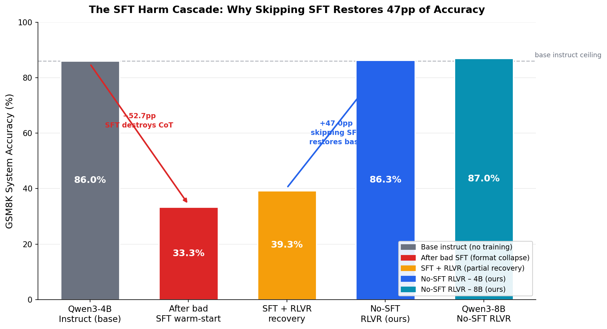
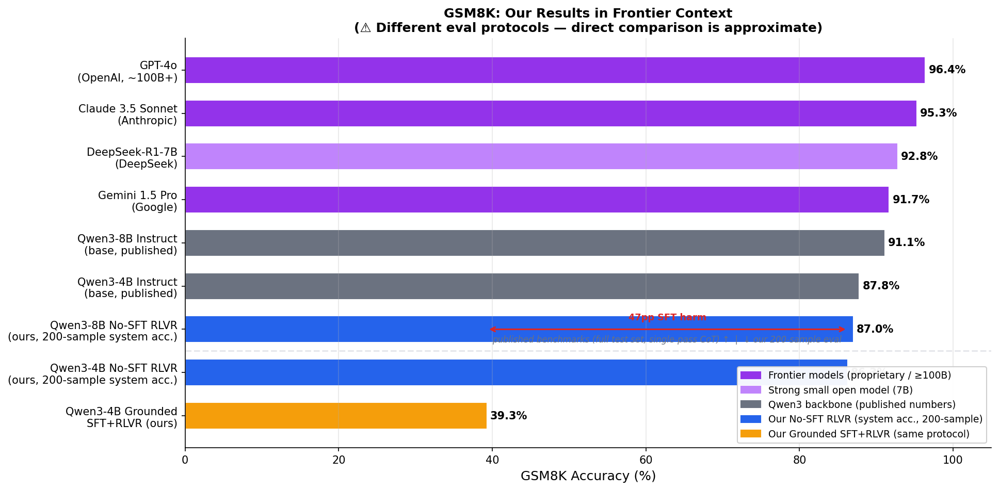
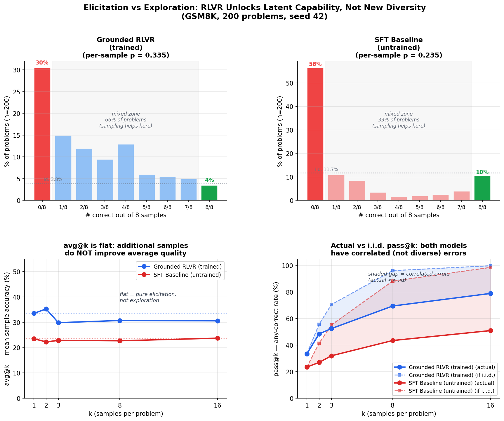
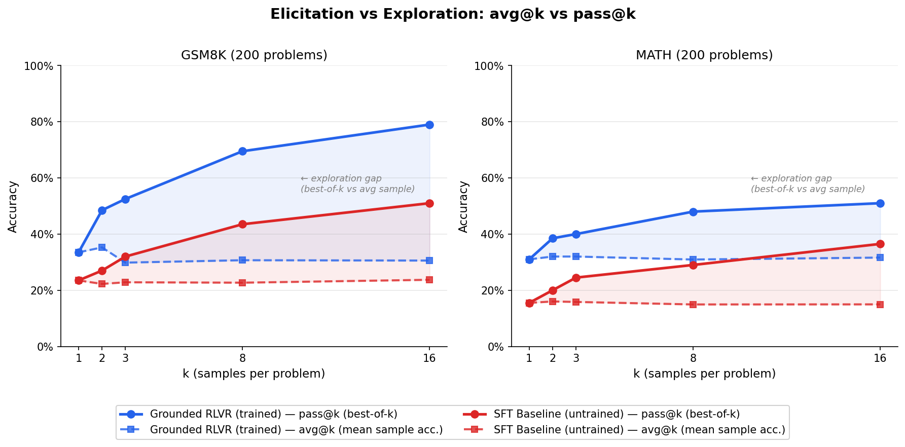
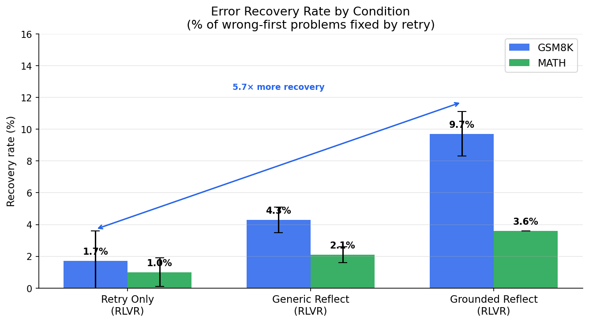
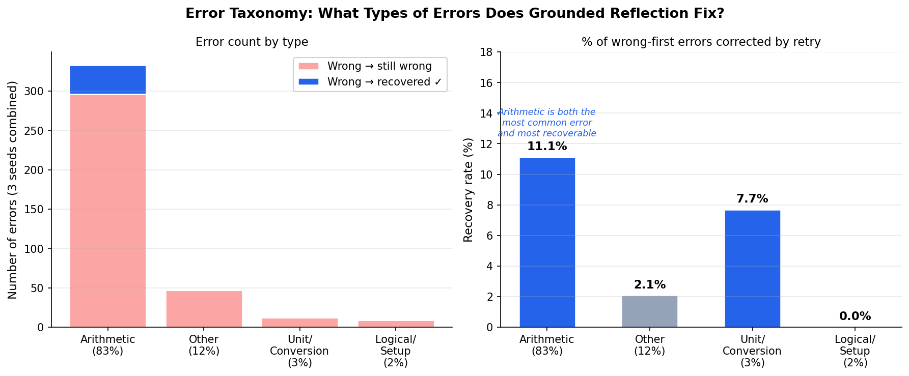

# Grounded Reflection for Math Self-Correction

> **TL;DR:** Standard SFT warm-starts collapse a model's native chain-of-thought by ~50pp before RLVR training even begins. Skipping SFT entirely and applying RLVR directly to the base instruct model achieves **86–87% GSM8K system accuracy** at 4B–8B scale. Within the SFT paradigm, teacher-generated *grounded* reflections (citing the exact wrong line) recover **5.7× more errors** than generic reflect-and-retry, the strongest SFT-warmed result across 25 experimental phases.

**Paper:** [link to arXiv — coming soon]

---

## What This Is

This project studies self-correction in math reasoning: can a small language model (4B–8B) learn to reflect on its own wrong answers and fix them?

The central finding is not about reflection quality — it is about **SFT format harm**. Training on terse, structured answer formats destroys the base model's reasoning capability before RLVR training starts. Recognising this unlocks a dramatically simpler and more effective recipe: no SFT, just RLVR on the base instruct model.

Within the SFT-warm-start paradigm (which is the primary research object of this work), **Grounded Reflection** — where an 8B teacher model generates error corrections citing the verbatim wrong line from the student's failed attempt — outperforms every generic reflection and retry-only baseline by a large margin.

---

## Key Results

All results are on 200-problem held-out sets. "System accuracy" = correct on first attempt **or** after reflection + retry.

### 4B Model (Qwen3-4B-Instruct-2507), 3 seeds mean ± std

| Condition | GSM8K system | MATH system |
|---|---|---|
| Base instruct (no training) | ~82–87% | ~45–52% |
| **No-SFT RLVR** ← main finding | **86.3 ± 1.4%** | **51.9 ± 2.5%** |
| Grounded Reflection SFT + RLVR | 39.3 ± 0.5% | 19.8 ± 0.6% |
| Generic Reflect-Full RLVR | 32.5 ± 0.0% | 18.7 ± 0.3% |
| Retry Only RLVR | 34.5 ± 1.3% | 19.2 ± 3.3% |
| GRPO Reflect-Full | 29.2 ± 0.3% | 17.0 ± 0.5% |

> The ~47pp gap between No-SFT RLVR and every SFT-warmed condition is the core finding. The SFT curriculum — not the RL algorithm — is the bottleneck.

### 8B Model (Qwen3-8B), single seed

| Condition | GSM8K first | GSM8K system | MATH first | MATH system |
|---|---|---|---|---|
| No-SFT RLVR + Grounded Reflection | 83.0% | **87.0%** | 65.5% | **67.0%** |

Evaluated with 4096-token budget (GSM8K) and 8192-token budget (MATH) to accommodate thinking-mode reasoning traces.

### Generalisation (SVAMP held-out, never seen during training)

| Condition | SVAMP system accuracy | Recovery rate |
|---|---|---|
| Grounded Reflection SFT + RLVR | 80.2 ± 0.3% | 24.6 ± 2.9% |

---

## Key Findings (Summary)

**1. SFT format harm is real and large.** Training on terse `#### N` answer formats collapses the base model's chain-of-thought reasoning by ~50pp. RLVR from the degraded checkpoint can only partially recover. The capability loss is irreversible within 500 RLVR steps.

**2. No-SFT RLVR is dramatically better.** Applying RLVR directly to the base instruct model achieves 86.3% GSM8K system accuracy at 4B — matching or exceeding the published base model figure and far exceeding every SFT-warmed condition tested.

**3. Grounded reflection beats generic reflection.** Within the SFT paradigm, teacher-generated grounded reflections (exact wrong-line citation + correction) recover 5.7× more GSM8K errors than blind retry (9.7% vs 1.7% recovery rate). The gain is in the reflection quality, not first-attempt accuracy.

**4. GRPO ≠ RLVR at 4B, but converges at 8B.** GRPO underperforms RLVR by 3.3pp at 4B due to reward sparsity in long reflection trajectories. At 8B both algorithms are statistically indistinguishable. RLVR is the safer choice at smaller scales.

**5. Reflection template collapse.** With SFT warm-start, 100% of generated reflections are identical generic strings regardless of problem content. The model learned to emit a fixed template, not to read and diagnose its own errors. Grounded SFT forces problem-specificity via verbatim wrong-line citation.

**6. RLVR is elicitation, not exploration.** avg@k (mean per-sample accuracy) is flat across all k for both trained and untrained models — additional samples don't improve quality. Both models have highly correlated errors: actual pass@k reaches only 49–72% of the theoretical i.i.d. ceiling, meaning failures repeat across samples rather than being independently random. RLVR's benefit is purely in per-sample accuracy (p: 23.5% → 33.5%) and in moving problems out of a hard "always-wrong" failure regime (56.5% → 30.5% of problems always wrong at k=8). It does not create diverse solution paths; it unlocks latent correct paths the model already knew.

---

## Figures

### The SFT Harm Cascade

The single most important visualization: standard SFT warm-starts on terse answer formats destroy ~53pp of base-model accuracy before RLVR training even begins. Removing the SFT stage entirely restores performance to the base instruct ceiling in a single step.

<p align="center">
  
</p>

---

### Context vs Frontier Models (GSM8K)

Our No-SFT RLVR result (86.3% 4B, 87.0% 8B) sits within ~1pp of the published Qwen3 instruct base — meaning RLVR successfully *elicits* existing capability without adding new knowledge. Frontier models (GPT-4o, Claude 3.5, Gemini) achieve 91–96% on the full GSM8K test set; our models are trained for ~500 steps on ~7K problems with LoRA rank 8.

<p align="center">
  
</p>

> ⚠ Frontier numbers are from published benchmarks (full 1319-example test set, single-pass CoT). Our numbers are from a 200-example held-out subset with system accuracy (first attempt OR retry). Not directly comparable, but the relative ordering within our conditions is fully controlled.

---

### Elicitation vs Exploration: Deep Dive

Does sampling more times help because the model *explores* new correct paths, or because it has a higher per-sample hit rate? This four-panel figure gives the precise answer.

<p align="center">
  
</p>

**What the panels show:**

**Top row — per-problem correctness distribution (k=8 samples each):** The baseline (right) is strongly bimodal: 56% of problems are "always wrong" regardless of how many times you sample, 10% are "always right." Only 33% of problems are in the mixed zone where sampling actually helps. RLVR (left) reshapes this: the "always wrong" hard-failure bucket shrinks from 56% → 30%, and 66% of problems move into the mixed zone where at least some samples are correct.

**Bottom left — avg@k is flat for both models:** Per-sample accuracy does not increase with k. Additional samples don't make the model smarter; you're drawing from the same distribution each time. This rules out *exploration* — the model is not finding new solution paths with more samples.

**Bottom right — actual vs i.i.d. pass@k:** If samples were independent (i.i.d.), pass@k would grow rapidly to near 100% for the trained model by k=8. Actual pass@k (solid lines) lags far behind the theoretical i.i.d. ceiling (dashed lines). Both models have **correlated errors** — when the model fails on a problem, it tends to fail the same way every time.

**Conclusion — elicitation, not exploration:** RLVR does not increase output diversity. It increases per-sample accuracy p (from 23% → 33%) and unlocks the latent capability to sometimes solve problems that were previously always failed — but once a problem is in the "always wrong" bucket, no amount of sampling recovers it. This directly supports the Chen et al. 2025 elicitation framing: RLVR reshapes sampling toward already-latent correct paths rather than discovering new ones.

---

### avg@k vs pass@k (overview)

<p align="center">
  
</p>

The trained model at N=1 beats the untrained baseline at N=16 on GSM8K. The gain is from higher per-sample accuracy, not compute.

---

### Error Recovery Rate by Condition

<p align="center">
  
</p>

Grounded Reflection recovers 5.7× more GSM8K errors than Retry Only (9.7% vs 1.7%) and 3.6× more MATH errors. First-attempt accuracy is nearly identical across all three conditions (~33% GSM8K) — the gain is entirely in the reflection quality.

---

### Error Taxonomy: What Does Grounded Reflection Actually Fix?

<p align="center">
  
</p>

83% of wrong-first-attempt errors are arithmetic in nature, and these are also the most recoverable (11.1% fixed by retry). Logical/setup errors are essentially unrecoverable (0.0%) — the reflection mechanism localizes arithmetic mistakes but cannot rediagnose the problem from scratch.

---

### RLVR Lift over SFT by Condition (3 seeds, mean ± std)

<p align="center">
  
</p>

Grounded Reflection is the only condition with consistent positive RLVR lift on both benchmarks. The dashed red line marks the No-SFT RLVR ceiling — the 86.3% GSM8K / 51.9% MATH target that all SFT-warmed conditions fall well short of.

---

### Scaling: 4B vs 8B (RLVR vs GRPO)

<p align="center">
  
</p>

GRPO underperforms RLVR by 3.3pp at 4B but matches it at 8B — a capacity × algorithm interaction. Both algorithms improve with scale; the dashed red line again shows the No-SFT RLVR ceiling far above all SFT-warmed conditions at both scales.

---

## Setup

```bash
git clone https://github.com/your-username/lm-reflection-credit
cd lm-reflection-credit
python -m venv .venv && source .venv/bin/activate  # or .venv\Scripts\activate on Windows
pip install -r requirements.txt
```

### Data

```bash
# Download and preprocess GSM8K + MATH
python scripts/prepare_data.py
```

---

## Usage

### No-SFT RLVR (recommended — best results, simplest recipe)

```powershell
# 4B model, seed 42
python scripts\train_rrr.py `
    --reflection_mode grounded `
    --seed 42 `
    --run_name rrr-nosft-4b-r8-seed42 `
    --base_model Qwen/Qwen3-4B-Instruct-2507 `
    --max_steps 500
```

```powershell
# Eval
python scripts\eval_sft.py `
    --run_name rrr-nosft-4b-r8-seed42 `
    --mode reflect_grounded_retry `
    --base_model Qwen/Qwen3-4B-Instruct-2507 `
    --dataset both
```

### Grounded Reflection SFT + RLVR (best within SFT paradigm)

```powershell
# Step 1: Generate grounded SFT data (teacher = 8B, student = 4B)
python scripts\build_grounded_sft.py `
    --student_model Qwen/Qwen3-4B-Instruct-2507 `
    --teacher_model Qwen/Qwen3-8B `
    --limit 2000 `
    --out_jsonl data\processed\curriculum\reflect_grounded.jsonl

# Step 2: SFT warm-start
python scripts\train_sft_lora_tiny.py `
    --mode reflect_grounded --seed 42 `
    --run_name qwen3-4b-reflect_grounded-r8-seed42 `
    --max_steps 500

# Step 3: RLVR
python scripts\train_rrr.py `
    --reflection_mode grounded --seed 42 `
    --run_name rrr-grounded-r8-seed42 `
    --sft_checkpoint qwen3-4b-reflect_grounded-r8-seed42 `
    --max_steps 500

# Step 4: Eval
python scripts\eval_sft.py `
    --run_name rrr-grounded-r8-seed42 `
    --mode reflect_full_retry --dataset both
```

### 8B Model

```powershell
# No-SFT RLVR on 8B (single seed)
python scripts\train_rrr.py `
    --reflection_mode grounded --seed 42 `
    --run_name rrr-nosft-8b-r8-seed42 `
    --base_model Qwen/Qwen3-8B `
    --max_steps 500

# Eval — use higher token budget for MATH
python scripts\eval_sft.py `
    --run_name rrr-nosft-8b-r8-seed42 `
    --mode reflect_grounded_retry `
    --base_model Qwen/Qwen3-8B `
    --dataset gsm8k `
    --solve_max_new_tokens 4096 --reflect_max_new_tokens 1024 --retry_max_new_tokens 4096

python scripts\eval_sft.py `
    --run_name rrr-nosft-8b-r8-seed42 `
    --mode reflect_grounded_retry `
    --base_model Qwen/Qwen3-8B `
    --dataset math `
    --solve_max_new_tokens 8192 --reflect_max_new_tokens 2048 --retry_max_new_tokens 8192 `
    --output_suffix _8192tok
```

---

## Experimental Details

Full phase-by-phase experiment log (Phases 0–25, ~1600 lines) is in [`EXPERIMENTS.md`](EXPERIMENTS.md).

### Models

| Role | Model ID | Parameters |
|------|----------|-----------|
| 4B student | `Qwen/Qwen3-4B-Instruct-2507` | 4B |
| 8B student | `Qwen/Qwen3-8B` | 8B |
| 8B teacher (SFT data only) | `Qwen/Qwen3-8B` (no_think mode) | 8B |

### Datasets

| Split | Source | Size | Use |
|-------|--------|------|-----|
| Train | GSM8K train | 7,473 | RLVR rollouts + SFT curriculum |
| Train | MATH train | 7,500 | RLVR rollouts + SFT curriculum |
| Eval | GSM8K held-out | 200 | All evals |
| Eval | MATH held-out | 200 | All evals |
| Eval | SVAMP test | 1,000 | Held-out generalisation only |

### Hyperparameters

**LoRA:** rank 8, attention + MLP + unembed, seeds 42/0/1 (3 runs per condition)

**SFT:** lr=2e-4, AdamW, batch=16 (4×4 accum), 500 steps, max_seq_len=1024

**RLVR:** lr=1e-5, 4 problems/step, rejection-sampling (keep correct only), temperature=0.7, 500 steps

**GRPO:** lr=5e-7, K=8 rollouts/group, standard within-group advantage normalisation, 500 steps

---

## Repo Layout

```
scripts/
  train_sft_lora_tiny.py   # SFT warm-start
  train_rrr.py             # RLVR training
  train_rrr_grpo.py        # GRPO training
  build_grounded_sft.py    # Teacher-student SFT data generation
  eval_sft.py              # Evaluation (first-attempt + system accuracy)
  error_recovery_analysis.py  # Recovery rate breakdown
src/rrr/
  rrr_infer.py             # Prompt builders (grounded, full, plan, retry)
  train_rrr.py             # RLVR loop
data/
  processed/               # GSM8K, MATH, SVAMP splits + SFT curriculum
results/
  runs/                    # Per-run JSONL eval outputs
figures/                   # All paper figures
```

---

## Citation

```bibtex
@article{pei2025grounded,
  title   = {Grounded Reflection for Math Self-Correction: When SFT Helps and Hurts (dummy example)},
  author  = {Pei, Justin},
  year    = {2025},
  note    = {